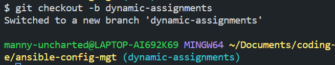
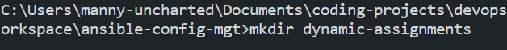
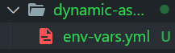
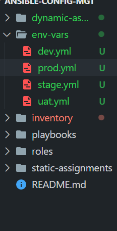
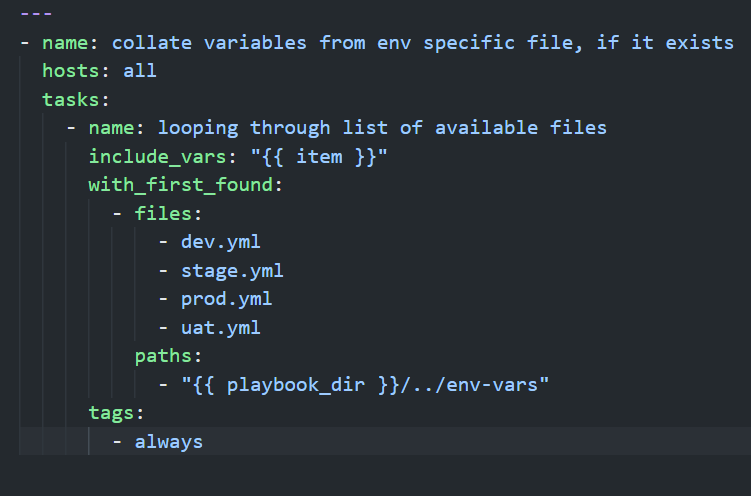
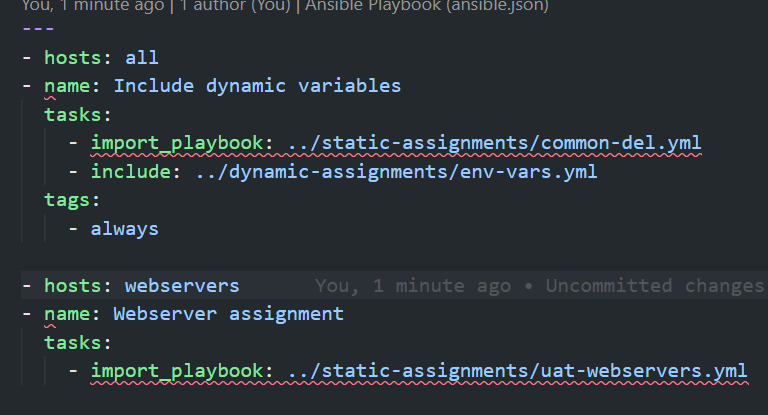
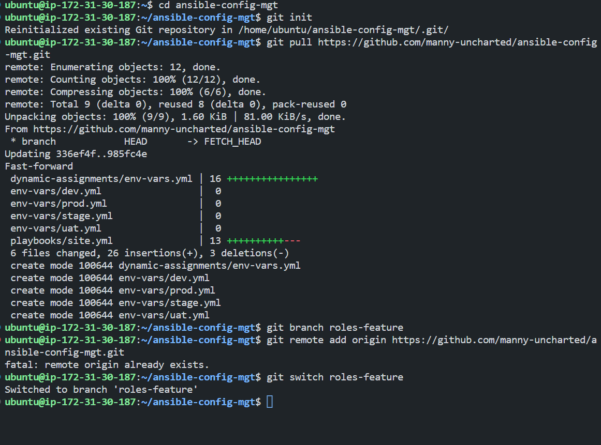
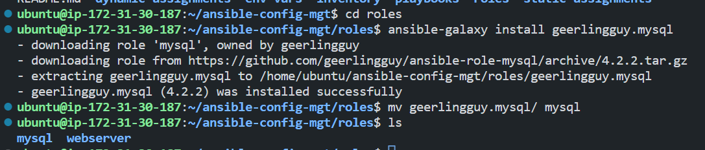
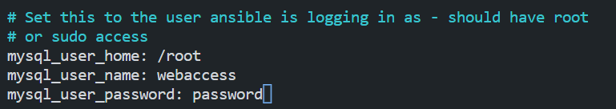
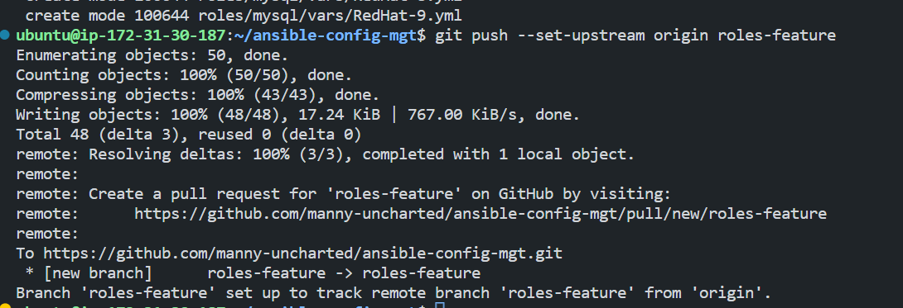

# Project-13-INTRODUCING-DYNAMIC-ASSIGNMENT-INTO-OUR-STRUCTURE


## Table of Contents.
- [Introduction](#introduction)
- [Prerequisites](#prerequisites)
- [Introducing Dynamic Assignment Into Our structure](#introducing-dynamic-assignment-into-our-structure)
- [Update Site.yml with Dynamic Assignments](#update-siteyml-with-dynamic-assignments)   
    - [Community Roles](#community-roles)

## Introduction
In this project, we will introduce dynamic assignments by using 'include' module.

Now you may be wondering, what is the difference between static and dynamic assignments?

Well, from the previous project, you can already tell that static assignments use the import Ansible module. The module that enables dynamic assignments is included.

Hence,

```
import = Static
include = Dynamic
```

When the import module is used, all statements are pre-processed at the time playbooks are parsed. Meaning, when you execute the site.yml playbook, Ansible will process all the playbooks referenced during the time it is parsing the statements. This also means that, during actual execution, if any statement changes, such statements will not be considered. Hence, it is static.

On the other hand, when the 'include' module is used, all statements are processed only during the execution of the playbook. Meaning, after the statements are parsed, any changes to the statements encountered during execution will be used.

Take note that in most cases it is recommended to use static assignments for playbooks because it is more reliable. With dynamic ones, it is hard to debug playbook problems due to their dynamic nature. However, you can use dynamic assignments for environment-specific variables as we will be introducing in this project.

## Prerequisites
- Infrastructure: AWS.
- Web Servers: Linux Red Hat.
- Database Server: Ubuntu 20.04 + MySQL.
- Storage Server: Red Hat 8 + NFS.
- Load Balancer: Ubuntu 20.04 (Nginx).
- Jenkins Server.
- Configure Ansible to perform dynamic assignments.
- Source Code: Download from <a href="https://github.com/manny-uncharted/ansible-config-mgt.git">here</a>.


## Introducing Dynamic Assignment Into Our structure

- In our GitHub repository start by creating a new branch called 'dynamic-assignments'.

```
git checkout -b dynamic-assignments
```

Results:



- Create a new directory called 'dynamic-assignments' in the 'ansible-config-mgt' directory.

```bash
mkdir dynamic-assignments
```

Results:



- Inside this folder, create a new file and name it 'env-vars.yml'. Then we will instruct 'site.yml' to include this playbook later. For now, we would keep building the structure.

Results:



- Our GitHub should have the following structure by now.


```
├── dynamic-assignments
│   └── env-vars.yml
├── inventory
│   └── dev
    └── stage
    └── uat
    └── prod
└── playbooks
    └── site.yml
└── roles (optional folder)
    └──...(optional subfolders & files)
└── static-assignments
    └── common.yml
```
<b>Note:</b> It is recommended to have all the codes managed and tracked in GitHub. This will help you to keep track of all the changes you make to your code.

Since we will be using Ansible to configure multiple environments, and each of these environments will have certain unique attributes such as server names, IP addresses, etc., we will need to create a separate inventory file for each environment. This will help us to easily manage our environments.

- Create a folder called 'env-vars' and inside it create new '.yml' files for each environment. This is where we would set our environment-specific variables.
Our folder structure should look like this:

```
├── dynamic-assignments
│   └── env-vars.yml
├── env-vars
    └── dev.yml
    └── stage.yml
    └── uat.yml
    └── prod.yml
├── inventory
    └── dev
    └── stage
    └── uat
    └── prod
├── playbooks
    └── site.yml
└── static-assignments
    └── common.yml
    └── webservers.yml
```

Results:



- Now in 'env-vars.yml' file add the following instruction

```
---
- name: collate variables from env specific file, if it exists
  hosts: all
  tasks:
    - name: looping through list of available files
      include_vars: "{{ item }}"
      with_first_found:
        - files:
            - dev.yml
            - stage.yml
            - prod.yml
            - uat.yml
          paths:
            - "{{ playbook_dir }}/../env-vars"
      tags:
        - always
```

Results:



Note: Notice 3 things to notice here:

We used include_vars syntax instead of include, this is because Ansible developers decided to separate different features of the module. From Ansible version 2.8, the include module is deprecated and variants of include_* must be used. These are:
- include_role
- include_tasks
- include_vars

In the same version, variants of import also introduces, such as:

- import_role
- import_tasks

We made use of special variables { playbook_dir } and { inventory_file }. { playbook_dir } will help Ansible to determine the location of the running playbook, and from there navigate to other paths on the filesystem. { inventory_file } on the other hand will dynamically resolve to the name of the inventory file being used, then append .yml so that it picks up the required file within the env-vars folder.

We are including the variables using a loop. with_first_found implies that, looping through the list of files, the first one found is used. This is good so that we can always set default values in case an environment-specific env file does not exist.


## Update Site.yml with Dynamic Assignments

- Update 'site.yml' file to make use of the dynamic assignment. It should now look like this.

```
---
- hosts: all
- name: Include dynamic variables 
  tasks:
  import_playbook: ../static-assignments/common.yml 
  include: ../dynamic-assignments/env-vars.yml
  tags:
    - always

-  hosts: webservers
- name: Webserver assignment
  import_playbook: ../static-assignments/webservers.yml
```

Results:




### Community Roles

Now it is time to create a role for MySQL database – it should install the MySQL package, create a database and configure users. But why should we re-invent the wheel? There are tons of roles that have already been developed by other open-source engineers out there. These roles are production ready and dynamic to accommodate most Linux flavors. With Ansible Galaxy again, we can simply download a ready-to-use ansible role, and keep going.

Hint: To preserve your your GitHub in actual state after you install a new role – make a commit and push to master your ‘ansible-config-mgt’ directory. Of course you must have git installed and configured on Jenkins-Ansible server and, for more convenient work with codes, you can configure Visual Studio Code to work with this directory. In this case, you will no longer need webhook and Jenkins jobs to update your codes on Jenkins-Ansible server, so you can disable it – we will be using Jenkins later for a better purpose.

- On Jenkins-Ansible server, make sure that git is installed with git --version, then go to 'ansible-config-mgt' directory and run.

```
git init
git pull https://github.com/<your-name>/ansible-config-mgt.git
git remote add origin https://github.com/<your-name>/ansible-config-mgt.git
git branch roles-feature
git switch roles-feature
```

Results:



- Inside 'roles' directory create your new MySQL role. We will be using the role from Ansible Galaxy. Run the following command, and rename the folder to 'mysql'.

```
ansible-galaxy install geerlingguy.mysql
mv geerlingguy.mysql/ mysql
```

Results:



- Read readme.md file, and edit roles configuration to use correct credentials for MySQL required for the tooling website.

```yaml
mysql_root_home: /root
mysql_root_username: root
mysql_root_password: root
```

Results:




- Now it is time to upload the changes to GitHub. Run the following commands.

```
git add .
git commit -m "add mysql role"
git push --set-upstream origin roles-feature
```

Results:



Now, that we are satisfied with our codes, we can create a Pull Request and merge it to main branch on GitHub.